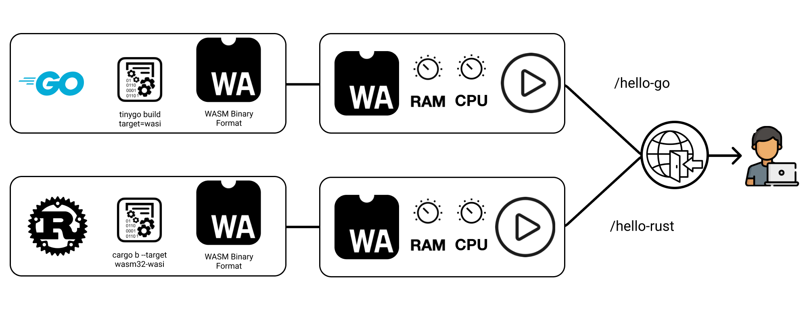

<div align="center">
  <h1>NoOps</h1>
  <p>NoOps is a serverless cloud for building applications without the hassle of infrastructure management.</p>
      <a href="https://discord.gg/6VNcm2Jx"></a>
</div>

## Why should I try out NoOps?
- Deploy with one line of code
- No CI/CD Pipelines
- No Docker Images
- Multi language applications

## Deploy Hello World in 30 seconds
We wrote this tutorial to showcase the NoOps way of building applications. You will create an application with one endpoint that returns "Hello World". 

This way you will familiarize yourself with our idea to split applications into handlers. These handlers are atomic and single purpose functions. These handlers execute based on triggers. So if you call the handlers endpoint, we execute it and return the result back to the caller. The figure below visualizes the idea.

 []()

We do so by using WebAssembly and its [component model](https://github.com/WebAssembly/component-model). The component model allows us to combine different programming languages, like Golang and Rust, into the same application. We create these components by compiling the handlers to WebAssembly component binaries. These components define their interfaces with the [WebAssembly Interface Type](https://github.com/WebAssembly/component-model/blob/main/design/mvp/WIT.md) (WIT). By using these WIT definitions, Components can call other components functions. It will be possible to reuse components within the application. For example, you write a database controller that offers CRUD functions. Now, instead of rewriting the logic in every handler, you just import the controller component. 

But for now, lets start our tutorial! 

We would be very happy, if you'd drop your feedback via issues or join our Discord. 


## Prerequisites 
### NoOps Binary
- Download binary from [releases](https://github.com/noopsio/noops/releases)
  
### Dependencies
- openssl

### Golang
- [Go](https://go.dev/doc/install) >= 1.20 
- [tinygo](https://tinygo.org/getting-started/install/linux/)

### Rust
- [Rust Toolchain](https://www.rust-lang.org/tools/install)
- Switch to Rust nightly  
`rustup default nightly`
- Cargo WebAssembly Compile Target  
`rustup target add wasm32-wasi`


###  Initialize a Project
When initializing the project, a *noops.yaml* file is created. This is also called manifest and contains all project information.  
The following command creates the project manifest with the name *demo*.
```
noops init demo
```
Output:
```
demo successfully initialized
```

A look at the manifest shows that we have successfully initialized the project. At the moment, we do not have any handlers.
```yaml
project: demo
handlers: []
```

### Create a handler
A handler represents an HTTP handler of the project and can be configured individually. The strength of noops is that each handler can be written in a different programming language.

> [!Note]  
> The creation of handlers is simplified by templates.  
> Templates can be updated via `noops template update`.

The following command creates a new handler called *hello-rust* and lists all installed templates from which one can be selected interactively. As the chosen name for the handler suggests, let's select the *Rust Hello World* template.  
```
noops create hello-rust
```
Output:
```
--- Creating  ---
Select a template:
> Name:         Rust Hello World
  Description:  A Hello World function in Rust
  Language:     Rust

  Name:         Rust Add Params
  Description:  A Function that adds path parameters as numerals
  Language:     Rust

  Name:         Golang Hello World
  Description:  A hello world function in Go
  Language:     Golang

  Name:         Golang Fibonacci
  Description:  A Fibonacci function in Go
  Language:     Golang
```

Another look into the manifest shows that our handler has been added successfully.
```yaml
project: demo
functions:
- name: hello-rust
  language: Rust
```

In addition, a new folder named *hello-rust* has been created which contains the selected template.
```
hello-rust
├── Cargo.toml
├── src
│  └── lib.rs
└── wit
   └── handler.wit
```


### Build the project
To build the project the following command is used.
Alternatively, only a single handler can be built. In this case, the name of the handler is added as a parameter to the build command.
```
noops build
```
Output:
```
--- Building project ---
[1/1] ✔️ hello-rust
```
After successful compilation a new *out* folder is created in the handler folder which contains the *handler.wasm*.
```
hello-rust
├── Cargo.lock
├── Cargo.toml
├── out
│  └── handler.wasm
├── src
│  └── lib.rs
├── target
│  ├── CACHEDIR.TAG
│  ├── release
│  └── wasm32-wasi
└── wit
   └── handler.wit
```

### Deploy the project
The deployment process consists of matching the already uploaded handlers and creating a so-called *deployment plan* which can consist of different deployment steps:
- new (+)
- change (~)
- delete (-)

If the deployment plan is approved, the project is deployed, the handlers are stored as endpoints and the routes are set up. 

> [!Note]  
> To deploy to the noops cloud, you must first login via `noops login`.  
> This triggers a GitHub authentication.

The following command deploys the whole project.
Alternatively, only one handler can be deployed by adding the name of the handler as a parameter to the deploy command.
```
noops deploy
```
Output:
```
--- Deploying project ---
Changes:
        + hello-rust
[1/1] ✔️ Creating module hello-rust  
```

### Project status
To get information about the project the following command is used. This can also be applied to a single handler by appending the handler name to the command.
```
--- Showing Project ---
Name:           demo
Deployed:       true
Components:     1

Name:           hello-rust
Language:       Rust
Build:          true
Deployed:       true
Link:           https://app.noops.rocks/rvRb1EP66VX_Nk-OhNnep
```
Since the handler is deployed, a link to the endpoint is also provided. This can be used to call the endpoint.  
> [!Note]  
> Do not forget to use the link that is displayed with your handler.
```
curl https://app.noops.rocks/rvRb1EP66VX_Nk-OhNnep
```
Output:
```
Hello from Rust!
```

## :warning: Help Us Improve :warning:

Obviously, this is just a rudimentary aplha version of what we envision the cloud to be.

However, we want to tailor the feature set to your needs.

Please let us know what features you miss the most and we will make sure to implement them!

Feel free to open an issue and get in touch with us!
