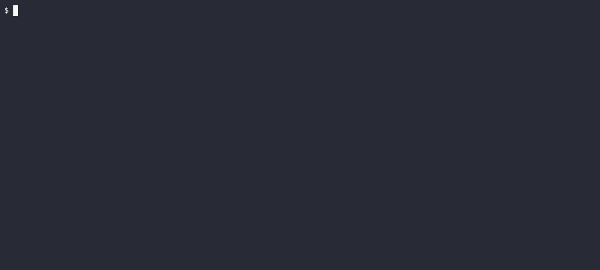

# NoOps
## Prerequisites 

- Libssl `sudo apt install libssl-dev`
- GitHub Account

### Golang
-   [Go](https://go.dev/doc/install) >= 1.20 
-   [tinygo](https://tinygo.org/getting-started/install/linux/)

### Rust
- [Rust Toolchain](https://www.rust-lang.org/tools/install)
- Switch to Rust nightly  
`rustup default nightly`
- Cargo WebAssembly Compile Target  
`rustup target add wasm32-wasi`

## CLI Commands

- noops 

## Hello-World

1. Initialize your Project -- `noops init`
    
2. Login into the NoOps Cloud `noops login`
3. Add your first function -- `noops create FUNCTION_NAME`
    
4. The source code is created at ./YOUR_FUNCTION_NAME
5. Build the functions -- `noops build`
FUNCTION_NAME`
    
6. Upload the project -- `noops deploy`
FUNCTION_NAME`
    
7. Curl your functions with the supplied links, or use the browser -- `curl YOUR_FUNCTION_LINK`
FUNCTION_NAME`
    

